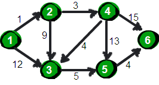
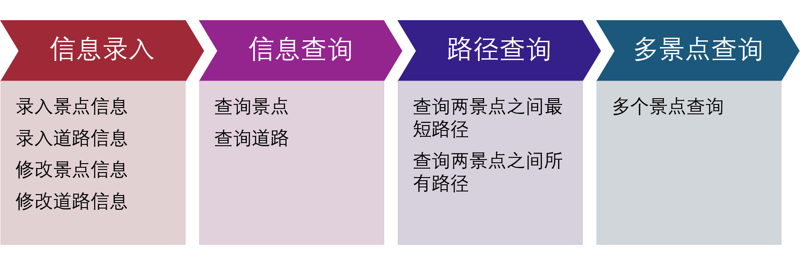
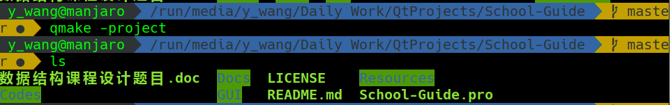
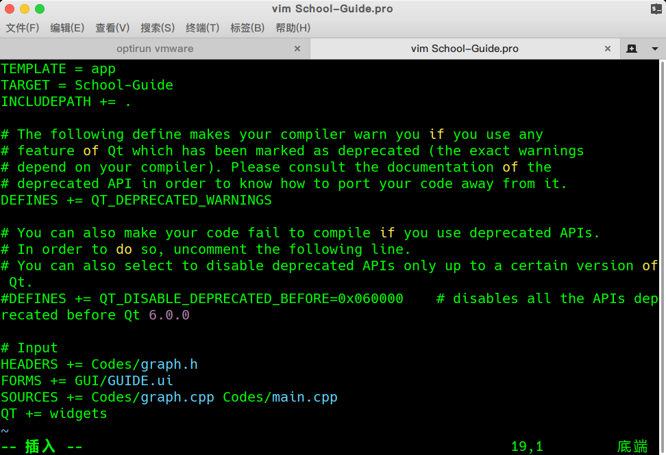
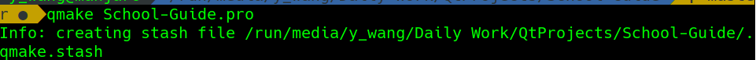
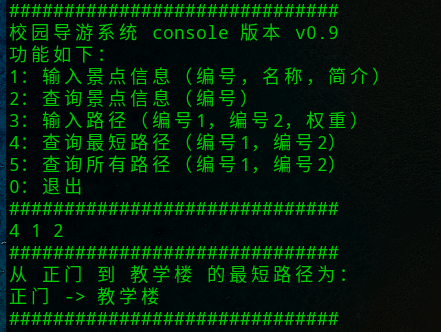
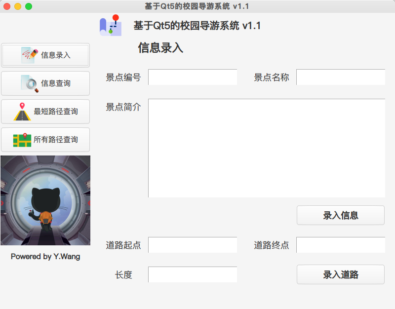
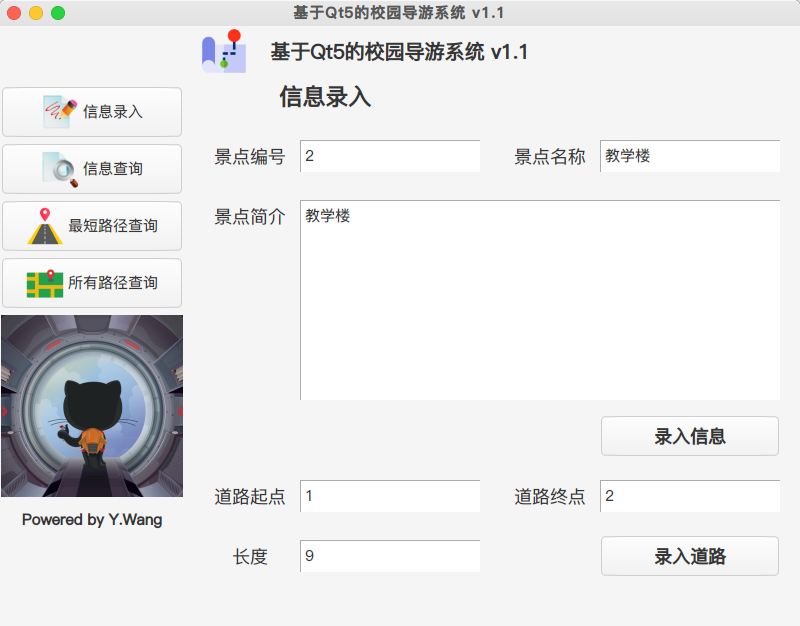
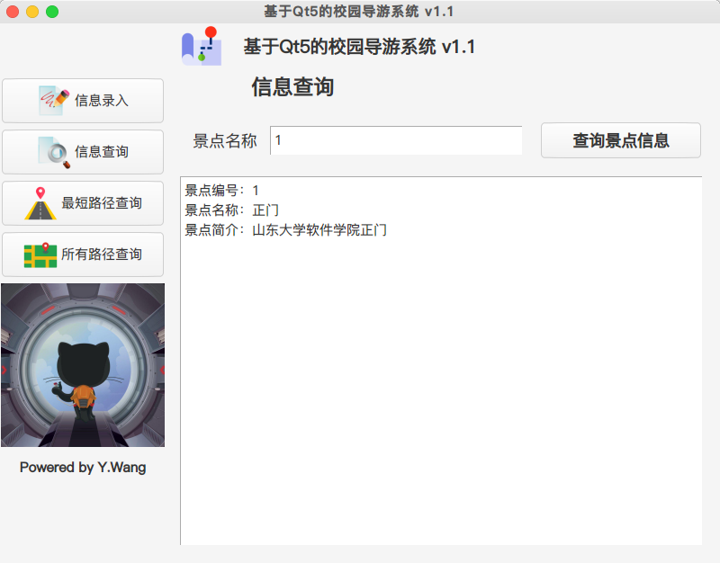
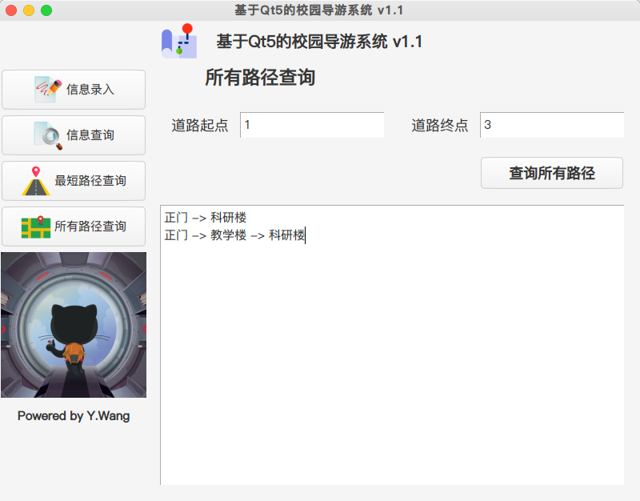

#  **校园导游系统 Qt5 图形界面版本 v2.1.5**

## **更新内容**
  **2019.2.25 Version 2.1.5**
  > 1. 新增道路信息查询功能，输入道路起点和终点即可查询道路具体信息
  > 2. 新增范例地图，支持一键录入已有范例信息
  > 3. 新增最短路径查询以及所有路径查询显示路径总长度
  > 4. 重新调整多景点查询功能
  > 5. 录入范例地图后，录入路径、查询最短路径时，在范例图片上均会显示路径线条。
  > 6. 在所有涉及路径查询的界面新增显示路径景点编号功能，也就是同时显示编号和名称

  **2019.2.19 Version 2.1**
  > 1. 界面重新布局
  > 2. 新增关于界面
  > 3. 修复无法显示路径的bug
  > 4. 图标调整
  > 5. 景点信息删除功能，可以删除这条编号的景点信息及其所有相关道路信息
  > 6. 道路信息删除功能，根据道路起点与终点删除整条道路信息

  **2019.2.18 Version 2.0**
  > 1. 新增多景点查询功能
  > 2. 对GUI界面布局进行微调
  > 3. 重新设定事件响应方式
  > 4. 对QString类型进行深入应用

## **设计流程** 

### **问题描述**
  * 随着现代旅游业的快速发展，图文声像导游方式和实地口语导游方式都已经不能满足现阶段旅游者的需求，信息化的飞速发展造就了地理信息系统(GIS)和全球定位系统(GPS)，促使消费者更多的选择自助游和自驾游等方式出行。而近年来高等院校的发展使得高校也成为了一个景点。如何让游客以最短的时间到达旅游目的地就是我的课程设计所寻求解决的问题。我打算通过最短路径算法结合图像化的表示方法，并结合实际情况以高等院校为例采集所需要的数据，在开发环境下模拟设计**导游咨询系统**，理论上使得游客可以轻松的寻找到最适合自己的旅游线路，并以此为依据合理安排自己的行程。

  * 用**无向网**表示校园景点平面图，图中顶点表示主要景点，存放景点的编号、名称、简介等信息，图中的边表示景点间的道路，存放路径长度等信息。要求能够回答有关景点介绍、游览路径等问题。 

### **设计目标**
  * 查询任意景点的相关信息。
  * 查询图中任意两个景点间的最短路径。
  * 查询图中任意两个景点间的所有路径。
  * 增加、删除、更新有关景点和道路的信息。
  * 求多个景点的最佳（最短）游览路径。
  * 实现通过图形用户界面进行人机交互。
  * 实现C++语言对于文件的读写操作。
  * 实现其他额外的附加功能。

### **Qt简介**

  

  > Qt 是一个著名的 C++ 应用程序框架。你并不能说它只是一个 GUI 库，因为 Qt 十分庞大，并不仅仅是 GUI 组件。使用 Qt，在一定程度上你获得的是一个“**一站式**”的解决方案：不再需要研究 STL，不再需要 C++ 的<string>，不再需要到处去找解析 XML、连接数据库、访问网络的各种第三方库，因为 Qt 自己内置了这些技术。

  > Qt 和 wxWidgets 一样，也是一个标准的 C++ 库。但是它的语法类似于 Java 的 Swing，十分清晰，而且使用信号槽（signal/slot）机制，让程序看起来很明白——这也是很多人优先选择 Qt 的一个很重要的原因。不过，所谓“成也萧何，败也萧何”。这种机制虽然很清楚，但是它所带来的后果是你需要使用 Qt 的 moc 对程序进行预处理，才能够再使用标准的 make 或者 nmake 进行正常的编译，并且信号槽的调用要比普通的函数调用慢大约一个数量级（Qt 4 文档中说明该数据，但 Qt 5 尚未有官方说明）。Qt 的界面也不是原生风格的，尽管 Qt 使用 style 机制十分巧妙地模拟了原生界面。另外值得一提的是，Qt 不仅仅能够运行在桌面环境中，还可以运行在**嵌入式平台以及手机平台**。

### **算法介绍**
  * **迪杰斯特拉算法**
    > 迪杰斯特拉算法是由荷兰计算机科学家狄克斯特拉于1959年提出的，因此又叫狄克斯特拉算法。是从一个顶点到其余各顶点的最短路径算法，解决的是有向图中最短路径问题。迪杰斯特拉算法主要特点是以起始点为中心向外层层扩展，直到扩展到终点为止。

    

  * **弗洛伊德算法**
    > 在计算机科学中，Floyd-Warshall算法是一种在具有正或负边缘权重（但没有负周期）的加权图中找到最短路径的算法。算法的单个执行将找到所有顶点对之间的最短路径的长度（加权）。虽然它不返回路径本身的细节，但是可以通过对算法的简单修改来重建路径。该算法的版本也可用于查找关系R的传递闭包，或（与Schulze投票系统相关）在加权图中所有顶点对之间的最宽路径。

    

### **流程分析**
  * 首先，启动程序，可以有左侧提供了信息录入，信息查询，路径查询以及多景点之间路径查询的功能入口。其中信息录入用来录入景点数据，信息查询用来查询景点的信息，路径查询可以帮助查询两个景点之间最佳的游览路径以及所有路径，多经典查询将这种最佳路径扩展到了多个景点之间。
  * 然后，根据不同的功能选项可有不同的进度，本程序提供相对完善的功能来实现这些操作。

  

### **概要设计**
  * **存储景点信息**

    * 使用结构体来存储景点信息，每个景点作为一个单独的景点类对象，含有景点编号（也就是唯一标识符），景点名称和景点简介的信息。同时应该使用文件读写操作确保景点信息能够保存在本地并且可供查询。
    * 此外，还可以录入景点之间的路径的数据，方便计算最短路径的问题。

  * **维护景点信息**

    通过一个特定的函数读取存储景点信息的文件，并且可以写入新的信息以及修改信息。

  * **单源最短路径**

    使用迪杰斯特拉算法可以求单源最短路径问题（不过边的权重需要为正数）。

  * **两点之间最短路径**

    使用弗洛伊德算法或者迪杰斯特拉算法都可以解决这个问题，具体实现时会有具体的分析。

  * **任意两点之间最短路径**

    弗洛伊德算法是一种在具有正或负边缘权重（但没有负周期）的加权图中找到最短路径的算法。

  * **多景点之间最佳路径**

    对于多个景点求最佳路径的问题，可以转化为先到第一个景点，再到第二个景点，最后到最后一个景点的问题，如果途中经过需要经过的某个节点，就将其标记为已访问，最后可以得到一条路径，本质上是对弗洛伊德算法进行改进。

  * **图形界面**

    使用Qt设计师进行图形界面的开发，同时加入信号与槽可以方便使用C++函数进行调用与对接。

### **编译方式**
  * 使用**qmake -project**命令来生成pro工程文件，这时可以看到Qt工程目录中已经生成了*.pro文件，此文件与项目文件夹同名。
  
  

 * 在有些版本的Qt中，需要添加widgets模块。因为源文件中使用到的类都包含在这个模块中，例如：main函数中用到的QApplication类。如果你的Qt版本是Qt4，包含这个模块可能会出错，所以为了保证与Qt4的兼容性，需要添加代码。
  
  

 * 在命令行输入**qmake -工程名.pro**，会自动生成makefile文件以及.stash文件，后续只需要一条命令就可以编译完成。

  

 * 命令行输入**make**，g++编译器就会自动完成编译生成最终的二进制文件，然后输入 **./工程名** 就可以在Linux下运行编译好的Qt程序。

### **控制台版本示例**
* **范例地图**
  
  以山东大学软件园校区地图为例，进行简单的校园导游系统测试。

  

* **主界面**

  

* **查询景点信息**

  * 要想录入信息，只需要按照控制台程序提示的操作编号，输入1，再依次输入景点的编号名称以及简介信息即可录入景点信息。例如录入编号为2的教学楼的景点信息，只需要进行图示操作。
  * 查询正门景点的景点信息，输入编号1，就可以看到信息。

  

* **查询路径**

  * 以正门景点为例，可以看到在景点1正门与景点2教学楼之间存在一条长度为9的路径，按照提示输入编号3，然后依次输入1 2 9，即可将这条路径录入。
  * 在景点1正门与景点2教学楼之间存在多条路径，其中从1->2这条路径是最短的，可以通过查询最短路径的操作来查看这条路径。

  

### **图形界面版本示例**

* **主界面**

    

* **录入信息**

  * 在图形界面程序中录入信息，只需要点击信息录入按钮，在右侧对应的位置填写好对应的项目，再点击录入信息按钮即可完成录入。

  * 在图形界面程序中录入道路信息，仍然需要点击信息录入按钮，在右侧对应的位置填写好对应的项目，再点击录入道路按钮即可完成录入。值得一提的是，录入景点信息的界面与录入道路信息的界面，为了方便起见，特意放在了一起进行处理。

  * 在本图形界面程序中，景点以及道路信息的修改仍然与控制台程序相同，采用覆盖修改的方法，因此，只需要按照录入景点道路信息的办法覆盖录入就可以完成操作，示意图如下所示。

  

* **查询信息**

  * 点击左侧快捷入口的信息查询按钮，输入景点编号，例如正门的景点编号1，点击查询景点信息按钮，就可以在下方的文本框中输出景点的详细信息。

  

* **查询路径**

  * 点击左侧的所有路径查询按钮，输入路径起点和终点就可以进行查询。例如，我们看到在正门景点1与科研楼景点3之间存在两条路径，可以通过GUI程序查询这两条路径。

  